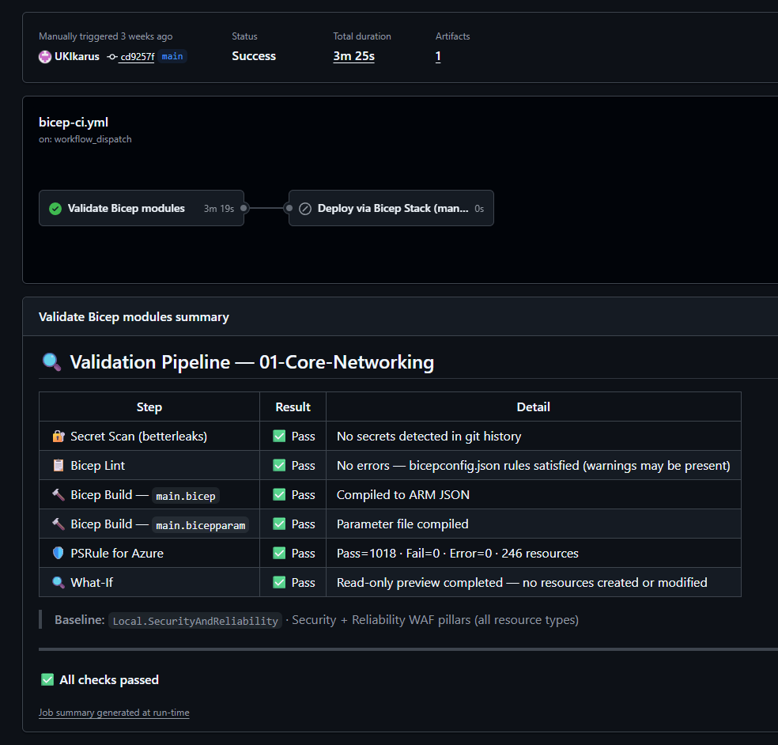

[![LinkedIn][linkedin-shield]][linkedin-url][![MIT License][license-shield]][license-url][![Contributors][contributors-shield]][contributors-url][![Forks][forks-shield]][forks-url][![Stargazers][stars-shield]][stars-url][![Issues][issues-shield]][issues-url]

 

  

  <h1>Azure Reference Architecture</h1>
  
Enterprise-grade Cloud Portfolio/reference architectures using Bicep (AVM), Terraform, OIDC, and GitHub Actions.

  

    <a href="https://github.com/UKIkarus/Azure-Reference-Architecture"><strong>Explore the docs »</strong></a>
    &nbsp;·&nbsp;
    <a href="https://github.com/UKIkarus/Azure-Reference-Architecture/issues">Report Bug</a>
  

  
Table of Contents

  <ol>
    <li>
      <a href="#about-the-project">About The Project</a>
      <ul>
        <li><a href="#built-with">Built With</a></li>
      </ul>
    </li>
    <li>
      <a href="#getting-started">Getting Started</a>
      <ul>
        <li><a href="#prerequisites">Prerequisites</a></li>
        <li><a href="#deployment">Deployment</a></li>
      </ul>
    </li>
    <li><a href="#roadmap">Roadmap</a></li>
    <li><a href="#architecture-principles">Architecture Principles</a></li>
    <li><a href="#contact">Contact</a></li>
  </ol>

## About The Project

This repository serves as a pesronal professional-grade portfolio for Azure Solutions Architecture. It demonstrates the ability to design, deploy, and govern complex cloud environments using modern Infrastructure as Code (IaC) tools and DevOps practices. 🏗️

The primary goal is to provide **"Tangible Proof"** of architectural logic, focusing on:
* **Tool Versatility:** Side-by-side implementations using both **Bicep** and **Terraform**.
* **Scalability:** Hub-and-Spoke networking patterns.
* **Security:** Zero-trust identity management and automated governance.
* **Cost Management:** Ephemeral "Deploy-and-Destroy" lab environments.

### Built with

Core technologies used across the portfolio:

- **Azure** - the target cloud platform.
- **Bicep** - primary IaC for Azure-native patterns and modules.
- **Terraform** - alternative IaC track for market parity and comparison.
- **GitHub Actions** - CI/CD, including OIDC-based passwordless deployments.
- **Ubuntu** - recommended local environment for CLI tooling.
- **BetterLeaks** - Git/Secret leaks assessment tool.
- **PSRule (Azure)** - Testing against validation rules for WAF best practices before touching deployment/production.

## Getting Started

To explore these architectures, you will need your own Azure Subscription. This project utilizes OIDC for secure, passwordless authentication between GitHub and Azure.

### Prerequisites

* Azure CLI & Bicep CLI installed (Ubuntu/Linux)
* Terraform installed
* An active Azure Subscription (M365 Developer/MSDN recommended)

## 🏗️ Solution Portfolio

This repository is organized into modular, enterprise-grade reference architectures demonstrating core cloud capabilities and operational patterns. Each solution includes an IaC implementation (Bicep and/or Terraform), CI/CD examples, evidence artifacts, and a short runbook.

| Solution | Primary Tech | Key Architectural Features | Screenshots |
| :--- | :--- | :--- | :--- |
| **[01-Core-Networking](./01-Core-Networking)** | Bicep/Terraform | Hub‑and‑Spoke, Azure Firewall, centralized egress and UDRs |  |
| **[02-Identity-Governance](./02-Identity-Governance)** | Bicep/Terraform | Entra ID automation, PIM, Conditional Access, RBAC matrices | |
| **[03-Scalable-App-Zone](./03-Scalable-App-Zone)** | Bicep / Terraform | Private Endpoints, App Service VNet Integration, App GW/WAF | |
| **[04-Observability-Policy](./04-Observability-Policy)** | Bicep / Terraform | Central Log Analytics, diagnostic routing, Azure Policy enforcement | |
| **[05-MultiRegion-DR](./05-MultiRegion-DR)** | Bicep/Terraform | Cross‑region replication, Front Door routing, failover validation | |

## Architecture Principles

Every project in this repository includes a "Why" section. As a Senior Architect, I prioritize:
1.  **Least Privilege:** Ensuring Service Principals and Users only have what they need.
2.  **Infrastructure as Code:** No manual clicks; every resource is reproducible and modular where possible.
3.  **Observability:** Built-in monitoring and topology visualization.
4.  **Keeping it real:** If a solution can be demonstrated with minimal effort, I will aim to do so, keep in mind that my choices for cost reduction and simplicity are for my own benefit as well as the purposes of this repository, as such they should be taken with a pinch of salt, for example: I may choose to use monolithic approaches vs modular design as well as lower cost alternatives to enterprise level solutions to reduce costs when deploying for demo purposes. (feel free to ask questions!)

## Contact

Daryl Howard - [LinkedIn Profile][linkedin-url]

Project Link: [https://github.com/UKIkarus/Azure-Reference-Architecture](https://github.com/UKIkarus/Azure-Reference-Architecture)

[contributors-shield]: https://img.shields.io/github/contributors/UKIkarus/Azure-Reference-Architecture.svg?style=for-the-badge
[contributors-url]: https://github.com/UKIkarus/Azure-Reference-Architecture/graphs/contributors
[forks-shield]: https://img.shields.io/github/forks/UKIkarus/Azure-Reference-Architecture.svg?style=for-the-badge
[forks-url]: https://github.com/UKIkarus/Azure-Reference-Architecture/network/members
[stars-shield]: https://img.shields.io/github/stars/UKIkarus/Azure-Reference-Architecture.svg?style=for-the-badge
[stars-url]: https://github.com/UKIkarus/Azure-Reference-Architecture/stargazers
[issues-shield]: https://img.shields.io/github/issues/UKIkarus/Azure-Reference-Architecture.svg?style=for-the-badge
[issues-url]: https://github.com/UKIkarus/Azure-Reference-Architecture/issues
[license-shield]: https://img.shields.io/github/license/UKIkarus/Azure-Reference-Architecture.svg?style=for-the-badge
[license-url]: https://github.com/UKIkarus/Azure-Reference-Architecture/blob/master/LICENSE.txt
[linkedin-shield]: https://img.shields.io/badge/-LinkedIn-black.svg?style=for-the-badge&logo=linkedin&colorB=555
[linkedin-url]: https://linkedin.com/in/daryl-howard
